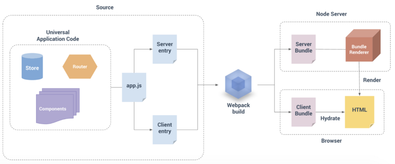

## 这是一个vue的SSR项目

### 安装依赖
安装vue-server-renderer,express,nodemon  

### 编写启动脚本
借助nodemon实现热更新
```bash
nodemon ./server/index.js
```

### 路由配置
安装vue-router并进行相关配置

这里和平常配置路由的方式是不一样的，
平常在配置路由的时候只需要返回一个router的实例
但是在这里必须要返回一个创建router实例的工厂函数  

主要的原因在于：客户端只有一个用户在操作,
所以只需要返回一个路由实例即可  

但是在服务端，是有n多个用户需要使用到路由，
此时，只返回一个路由是远远不够的   

配置Vue实例也是同理

### 构建


#### 入口 
app.js

#### 服务端入口
entry-server.js

#### 客户端入口
entry-client.js

#### webpack打包
将文件打包成两个部分


